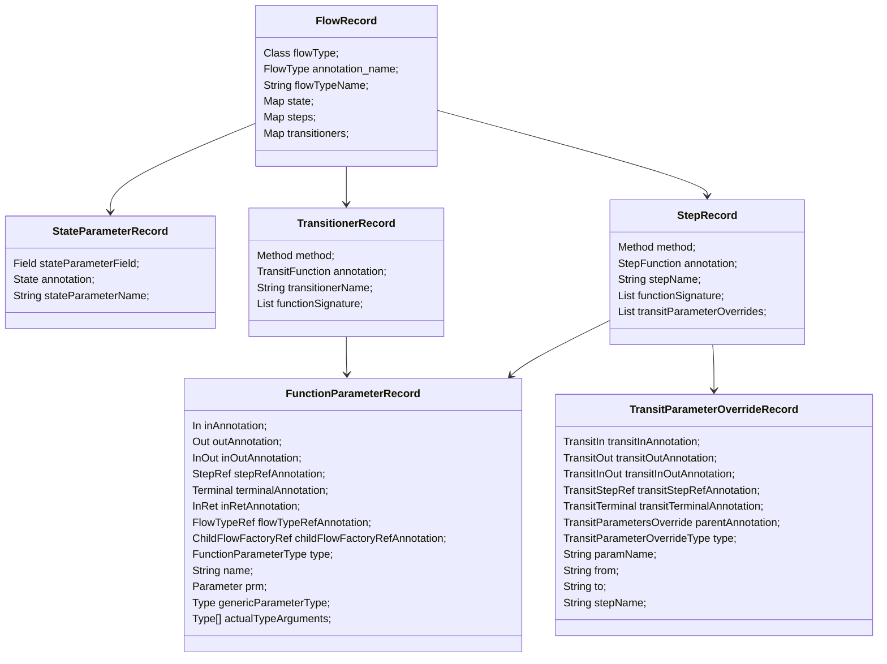

```mermaid  
classDiagram  
  
FlowRecord --> StateParameterRecord  
FlowRecord --> StepRecord  
FlowRecord --> TransitionerRecord  
  
StepRecord --> FunctionParameterRecord  
StepRecord --> TransitParameterOverrideRecord  
TransitionerRecord --> FunctionParameterRecord  
  
class FlowRecord {  
  Class flowType;  
  FlowType annotation_name;  
  String flowTypeName;  
    
  Map<String, StateParameterRecord> state;  
  Map<String, StepRecord> steps;  
  Map<String, TransitionerRecord> transitioners;  
}  
  
class StateParameterRecord {  
  Field stateParameterField;    
  State annotation;    
  String stateParameterName;  
}  
  
class StepRecord {  
  Method method;    
  StepFunction annotation;    
  String stepName;    
    
  List<FunctionParameterRecord> functionSignature;    
  List<TransitParameterOverrideRecord> transitParameterOverrides;  
}  
  
class TransitionerRecord {  
  Method method;    
  TransitFunction annotation;    
  String transitionerName;    
    
  List<FunctionParameterRecord> functionSignature;  
}  
  
class FunctionParameterRecord {    
  In inAnnotation;    
  Out outAnnotation;    
  InOut inOutAnnotation;    
  StepRef stepRefAnnotation;  
  Terminal terminalAnnotation;  
  InRet inRetAnnotation;  
  FlowTypeRef flowTypeRefAnnotation;  
  ChildFlowFactoryRef childFlowFactoryRefAnnotation;  
    
  FunctionParameterType type;    
  String name;    
  Parameter prm;    
  Type genericParameterType;    
  Type[] actualTypeArguments;  
}  
  
class TransitParameterOverrideRecord {    
  TransitIn transitInAnnotation;    
  TransitOut transitOutAnnotation;    
  TransitInOut transitInOutAnnotation;    
  TransitStepRef transitStepRefAnnotation;    
  TransitTerminal transitTerminalAnnotation;    
    
  TransitParametersOverride parentAnnotation;    
    
  TransitParameterOverrideType type;    
  String paramName;    
  String from;    
  String to;    
  String stepName;  
}  
```