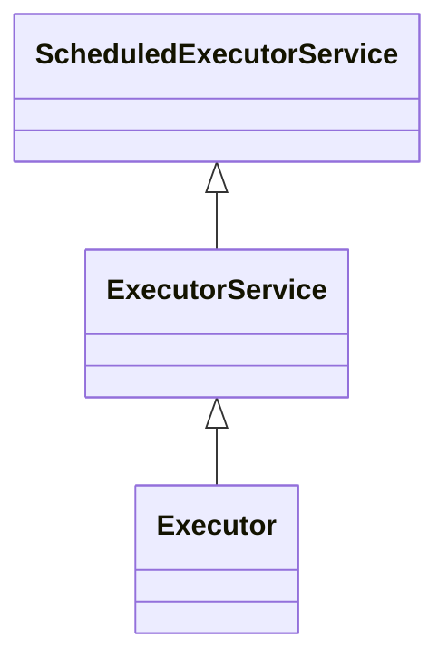

№000001
## Создать реализацию интерфейса `ScheduledExecutorService` на основе библиотеки vert.x.

### ScheduledExecutorService - документация
- https://docs.oracle.com/javase/8/docs/api/java/util/concurrent/ScheduledExecutorService.html

### Vert.x core - документация
- https://vertx.io/docs/vertx-core/java/

### Рекомендации:
ScheduledExecutorService имеет следующую структуру наследования:

Я бы рекомендовал следовать той же структуре и в реализации, т.е. для начала имплементировать `Executor`, затем наего основе `ExecutorService` и уже после этого переходить к `ScheduledExecutorService`

### Доп. инфо
- Тикет, который я отправил в официальный vertx, не нашедший поддержки.
    https://github.com/eclipse-vertx/vert.x/issues/5036
